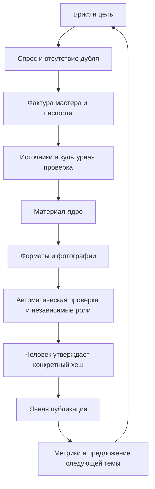

# Процесс и данные

Пути ниже — относительно рабочего проекта. Код может находиться в репозитории
или в `.bamboo/toolkit`; публичные данные всегда в `content/`.



Это десять стадий, не десять обязательных вызовов модели. Маленькая карточка не требует
сначала писать статью. Координатор назначает только необходимые роли, максимум три
параллельно и без дочерней рекурсии. Каждый получает пути, цель, критерии, границы и формат
результата. Все правки делает координатор; проверяющие возвращают отчёты.

## Минимальная задача

`new` создаёт `content/jobs/<slug>/`:

- `brief.json`: цель, аудитория, форматы, разрешённая фактура мастера.
- `sources.json`: проверенные источники; `claims.json`: связанные утверждения.
- `pack.json`: выбранные тексты и фотографии; `variants.md`: альтернативы.
- `research.md`: исследование и нерешённые вопросы.

Последующие файлы: `review.json`, `approval.json`, а для WordPress — `wordpress.json`.
Нет скрытой очереди фоновых задач. Состояние выводится из этих файлов и их хешей.

### Бриф

```json
{
  "schema_version": 1,
  "slug": "first-bowl",
  "topic": "Как выбирать чашу по фотографии",
  "audience": "A",
  "formats": ["card"],
  "product_ids": [],
  "intent": "понять, какие детали изделия спросить у мастера перед покупкой",
  "seo": {
    "page_type": "article",
    "cluster": "chawan",
    "target_url": null,
    "related_urls": []
  },
  "master_notes": "Только подтверждённые и разрешённые владельцем сведения",
  "master_notes_public": true,
  "demand": {"status": "unknown", "evidence": []}
}
```

`seo` необязателен для старых задач. Для индексируемой страницы он фиксирует роль URL, кластер и связи;
для чистого ВК/сторис допустим `page_type=social`. `target_url` и `related_urls` должны быть реальными URL.

`product_ids` пуст для общего редакционного материала. Для конкретного изделия укажите
ID паспорта; он должен существовать ещё при `new --products id`. `confirmed: true`
ставится только после подтверждения владельцем. Неизвестные параметры остаются `null`.
`examples/product.template.json` — непригодный к публикации шаблон, не реальный товар.

### Источники

`sources.json` — массив объектов:

```json
[{
  "id": "maker-note",
  "kind": "master",
  "title": "Разрешённая фактура мастера для этой задачи",
  "path": "content/jobs/first-bowl/maker-note.md",
  "visibility": "public",
  "verified_at": "2026-09-21"
}]
```

Локальный файл должен существовать. Тип `product` ссылается только на `content/products/`.
Тип `web` вместо `path` содержит `url`; записывать только действительно открытый и прочитанный
источник с датой проверки. Ссылка сама по себе не доказывает сказанное в тексте.
Для меняющихся сведений проверять актуальность при подготовке каждого материала.
Снимок утверждения включает локальные файлы источников, но не отслеживает изменение внешней страницы.
Короткую выписку и точный раздел источника можно сохранить в research.md без копирования чужой статьи.

`claims.json`:

```json
[{
  "id": "maker-fact",
  "text": "Конкретное подтверждённое утверждение",
  "source_ids": ["maker-note"],
  "status": "verified",
  "checked_by": "Имя проверившего или роль с идентификатором запуска"
}]
```

Не ставить `verified` до прочтения источника. Дополнительно указывать `locator` — страницу,
раздел или фрагмент, подтверждающий факт. `checked_by` агента — не человеческое разрешение публикации.

### Пакет

```json
{
  "schema_version": 1,
  "title": "Заголовок без неподтверждённого обещания",
  "description": "Описание для статьи; для других форматов допустима пустая строка",
  "formats": {
    "card": {
      "text": "Текст выбранной карточки со связанным фактом [[maker-fact]].",
      "cta": "Задайте мастеру вопрос о форме чаши.",
      "claims": ["maker-fact"]
    }
  },
  "photos": []
}
```

Метки `[[claim-id]]` необязательны в каждой фразе, но полезны проверяющему. Они удаляются
из экспорта. Массив `claims` обязателен для каждого формата. Валидатор проверяет ссылки
и числовые характеристики с единицами; **семантическую достоверность всего текста он не доказывает**.
Сторис: один экран на непустую строку `text`; заключительный призыв находится в `cta`.
Карусель: подписи к кадрам в `text`, соответствующий порядок — в массиве `photos`.
Не обещайте покупателю свойства, о которых не сказано в паспорте.

Фотография:

```json
{
  "path": "content/media/bowl-side.jpg",
  "sha256": "полный SHA256 из команды hash-file",
  "origin": "camera",
  "rights_confirmed": true,
  "product_ids": ["bowl-01"],
  "alt": "Что действительно видно на снимке",
  "caption": "Краткая подпись без выдуманных свойств"
}
```

Для каждого указанного товара по умолчанию требуется связанное фото. Декларацию происхождения
подтверждает человек: программа не распознаёт, снят ли файл камерой или сгенерирован.
Копии в экспорте сохраняют оригинальные байты, включая возможные EXIF-данные.
Перед добавлением фото удалите нежелательную геолокацию и проверьте права.

## Проверка, исправление и утверждение

`validate` проверяет обязательность фактуры, структуру, источники/утверждения, фото и хеши,
лимиты форматов, числовые характеристики, шаблонные остатки, некоторые секреты и клише.
Результат содержит `errors`, `warnings`, `counts`. Коды завершения: 0 — успешно, 1 — ошибки
контента, 2 — некорректная команда/данные/операционная ошибка. Предупреждение не доказывает
ошибку: например, опровержение лечебного мифа тоже может содержать слово «лечит».

Затем отдельные роли проверяют факты, культурный контекст, голос, намерение, приватность,
фото и соответствие заголовка содержанию. Их отчёты координатор сохраняет в `research.md`
или отдельных `review-<role>.md`, но не выдаёт за подпись человека.

`review-template` создаёт пустую человеческую рецензию. Человек заполняет reviewer, notes,
семь checks и warnings_acknowledged. При отсутствии фото он отмечает, что фото к этой задаче
не применимы. Нельзя автоматически проставлять все true ради прохождения проверки.

`status` выдаёт `slug@sha256`. `approve --confirm` проверяет рецензию и фиксирует эту версию.
Если текст изменён, взять новый токен, заново просмотреть пакет и записать его часть после `@`
в `review.json.content_hash`. Только после повторной проверки обновлять отметки и вызывать approve.
Существующая рецензия не перезаписывается командой review-template.

## Что считать завершением

Редакционная задача: validate пройден, превью доступно, источники перечислены, нерешённые вопросы
не скрыты. Задача на публикацию: получен фактический ID/URL WordPress либо построен локальный сайт
с явным указанием, что он ещё не выгружен. Сообщение «готово» без этих результатов недопустимо.
